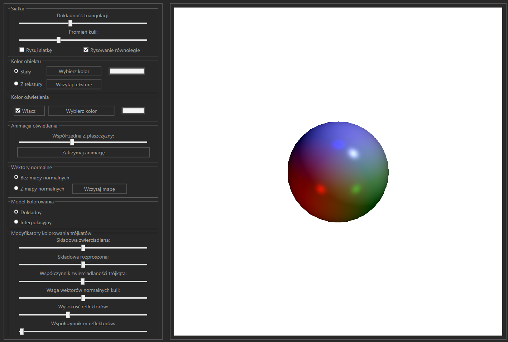

# Sphere-Shading-Model
A project that simulates the shading (Phong and Gouraud) of a sphere made in C# and WPF. 

## Details
Sphere is interpolated by triangles. There are four light sources. Three solid light casters with red, green and blue colors and another one spining light spot which color and z-position can be changed.

Color of each pixel of sphere is calculated and set on the pointer implementation of the bitmap. A filling algorithm with active edges table is used.

